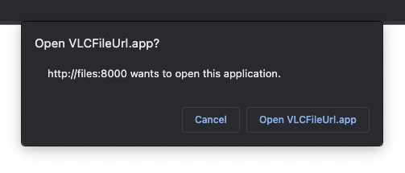

# VLCFileUrl

Open `vlc-file://foo` with VLC as `http://foo`.




## Rationale

So you're building a simple webapp to play video files (i.e. a minimal DIY plex-like media server).

The HTML5 [`<video>`](https://en.wikipedia.org/wiki/HTML5_video) tag can natively stream `.mp4` files, `.webm` files, etc.

But what about other types of video files, like `.mkv`?  Unfortunately, there's no good way to do this in the browser.

[VLC](https://www.videolan.org/vlc/) can play `.mkv` files, but downloading the file first isn't convenient -- we want to _stream_ it.  VLC can also stream `.mkv` URLs, but how to we get the browser to hand off the URL to VLC (without downloading the file)?

This is the problem.  There's no way to tell your browser that an `http://` URL to a specific type of file should be handled by an external application.

But if we invent our own URL scheme, we can register an external application to handle it natively.  That's what this app is for.

This app registers the URL scheme `vlc-file://`, rewrites those URLs as `http://` and hands them off to VLC for streaming.


## Simple

This is the simplest possible app which can do this.  No joke, here's the entirety of the source code:

```swift
import Cocoa

@main
class AppDelegate: NSObject, NSApplicationDelegate {

    @IBOutlet var window: NSWindow!
    
    func application(_ application: NSApplication, open urls: [URL]) {
        for url in urls {
            let httpUrlString = url.absoluteString.replacingOccurrences(
                of: "vlc-file://",
                with: "http://"
            )
            let job = Process()
            job.executableURL = URL(fileURLWithPath: "/usr/bin/open")
            job.arguments = ["-a", "VLC", httpUrlString]
            try? job.run()
            job.waitUntilExit()
        }
        NSApp.terminate(self)
    }
}
```


## License

[MIT](https://opensource.org/license/mit/), baby 😎.
